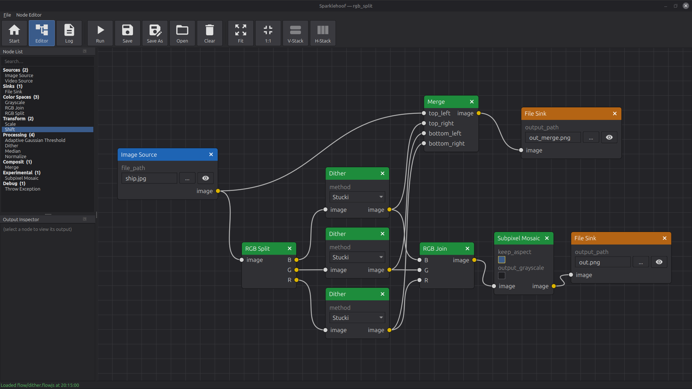

<p align="center">
  
</p>

# Sparklehoof

A Python desktop application for building image- and video-processing
workflows using a node-based visual editor. Drop image sources,
filters, and sinks onto a canvas, wire them up, hit **Run**, then tweak
parameters and watch the output update live in the built-in viewer.

Typical uses:

- Experiment with image processing operations (dithering, thresholding,
  normalisation, scaling, channel splitting/joining, …) without writing
  code.
- Compose filters into reusable flows and save them to disk.
- Batch-convert and composite images by wiring up file sources and
  sinks.

## Installation

Prerequisites: **Python 3.10** or newer.

```bash
pip install -r requirements.txt
```

## Running

```bash
python src/main.py
```

Optional command-line arguments:

| Argument | Description |
|---|---|
| `--no-splash` | Skip the startup splash screen |
| `--flow FILE` | Open the named flow directly in the editor. Accepts a full path to a `.flowjs` file or a bare flow name (looked up in `flow/`). |

## Usage

### Start page

<p align="center">
  
</p>

The app opens on the start page. From here you can:

- Type a name and click **Create** to open the node editor with a
  fresh, empty flow. Flow names use ASCII letters, digits, and
  `_ # + -`.
- Click **Open** to load an existing `*.flowjs` file from anywhere on
  disk.
- Click any tile in the **Recent flows** grid to jump back into a
  flow you had open recently.

### Node editor

<p align="center">
  
</p>

The editor is where flows are built. Key elements:

- **Node List** (dockable, left) — the palette of every available
  node, grouped by section. Drag a node onto the canvas to add it.
- **Canvas** (centre) — the flow graph. Drag from an output port to
  another node's input port to create a link; drag an existing link
  off a port to remove it. Scroll to zoom, middle-drag to pan.
- **Output Inspector** (dockable, below the node list) — shows the
  current output of whichever node you've selected. Float the dock
  and press <kbd>F11</kbd> for full-screen preview.
- **Toolbar** — **Run** executes the flow, **Save** / **Save As**
  persist it as `.flowjs`, **Open** loads one, **Clear** empties the
  canvas, **Fit** / **1:1** reset the zoom, and **V-Stack** /
  **H-Stack** align two or more selected nodes on a shared axis.

Flows containing still-image sources are **reactive**: the flow
re-runs automatically about 300 ms after any parameter change, so
adjustments appear in the viewer in near real time. Video and other
non-reactive sources are run only when you press **Run**.

## Built-in nodes

| Section | Nodes |
|---|---|
| Sources | Image Source, Video Source |
| Sinks | File Sink |
| Color Spaces | Grayscale, RGB Split, RGB Join |
| Transform | Scale, Shift |
| Processing | Adaptive Gaussian Threshold, Dither, Median, Normalize |
| Composit | Merge |

## License

MIT — see [LICENSE](LICENSE).
